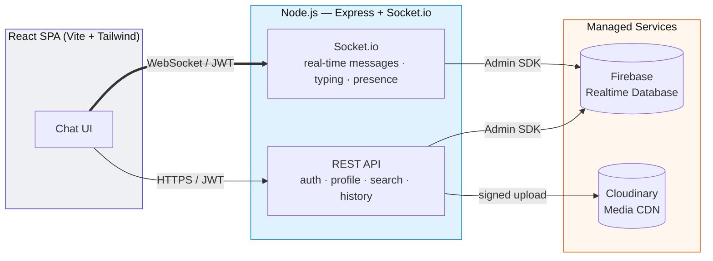

<div align="center">

# 💬 Anon Chat

### A full-stack, real-time, anonymous 1:1 chat application

Users are identified only by a randomly generated **6-character UID** — never by name or email —
letting two strangers find each other and chat instantly, in real time, with photo & video sharing.

[](https://react.dev/)
[](https://nodejs.org/)
[](https://expressjs.com/)
[](https://socket.io/)
[](https://firebase.google.com/)
[](https://cloudinary.com/)
[](https://tailwindcss.com/)
[](#license)

[Live Demo](#-live-demo) · [Screenshots](#-screenshots) · [Features](#-features) · [Architecture](#-architecture) · [Getting Started](#-getting-started)

</div>

---

## 📖 Overview

**Anon Chat** is a production-style messaging platform built to demonstrate a complete, secure,
real-time full-stack architecture — not a toy CRUD app. It intentionally solves a harder problem
than a typical chat tutorial: **anonymous discovery**. Instead of a public user directory (a privacy
and abuse risk), users share a private, unguessable 6-character code to connect — the same UX pattern
used by apps like Discord (`username#tag`) and Signal (safety numbers).

The project is split into a decoupled **Express/Socket.io API** and a **React SPA**, with **Firebase
Realtime Database accessed exclusively through a server-side Admin SDK** — the client never holds
database credentials, so the Firebase security rules can stay fully locked down (`.read`/`.write:
false` everywhere). Media (avatars, chat images/videos) is offloaded to **Cloudinary** rather than
stored in the database or on the app server, keeping the backend stateless and horizontally scalable.

> 🎯 **Built to showcase:** real-time systems design, secure auth, clean API/socket architecture,
> third-party service integration, and a polished, responsive, themeable UI — end to end.

---

## 🚀 Live Demo

| | |
|---|---|
| **App** | [your-deployed-url.com](#) *(add your deployed link here)* |
| **Video walkthrough** | [Watch on Loom / YouTube](#) *(add a 60–90s demo video link here)* |
| **Test it yourself** | Register two accounts (or use a second incognito window), copy the UID from *Profile*, search it from the other account, and start chatting in real time. |

> Replace the placeholders above once deployed — a live link and a short demo video are the two
> highest-impact additions you can make to this README for recruiter/hiring-manager review.

---

## 📸 Screenshots

<div align="center">

| Login | Chat — Light Theme | Chat — Dark Theme |
|:---:|:---:|:---:|
|  |  |  |

| Search by UID | Profile & Avatar Upload | Mobile View |
|:---:|:---:|:---:|
|  |  |  |

</div>

> 📁 Add your own screenshots to `docs/screenshots/` (create the folder) and they'll render above —
> GIFs of the theme switcher and real-time messaging make this section especially compelling.
> A quick way to capture them: run the app locally (see [Getting Started](#-getting-started)), open
> dev tools' device toolbar for the mobile shot, and use your OS screenshot tool or a GIF recorder
> (e.g. [Kap](https://getkap.co/), [ScreenToGif](https://www.screentogif.com/)) for the interactive ones.

---

## ✨ Features

**Identity & Security**
- Email/password authentication with `bcrypt`-hashed passwords and stateless JWT sessions
- Every user gets a random, collision-checked **6-character alphanumeric UID** at signup — the only
  identifier ever exposed to other users; email addresses are never shared
- Firebase Realtime Database rules are fully locked (`false` for all read/write) — every access goes
  through the authenticated Express API using the Admin SDK, so no DB credential ever reaches the browser

**Real-Time Messaging**
- Instant message delivery via **Socket.io**, authenticated per-connection with the same JWT as the REST API
- Multi-device/tab sync (a user's personal Socket.io room fans a message out to every open session)
- Live typing indicators and online/offline presence
- Full message history persisted server-side and paginated on load

**Media**
- Profile picture upload with automatic face-centered square cropping (Cloudinary transformations)
- In-chat photo & video sharing (25MB limit, validated by MIME type on both client and server)

**UI/UX**
- 6 switchable color themes (Light, Dark, Ocean, Sunset, Forest, Midnight) via CSS custom properties —
  instant, no re-render flash — persisted to `localStorage`
- Fully responsive: the chat list and active conversation swap on mobile, matching native messenger UX
- Optimistic, low-latency feel: messages render the instant the server acks the socket event

---

## 🏗 Architecture



**Why this shape?**
- **Client never touches Firebase directly** → database credentials stay server-side, and Firebase
  security rules can be fully closed instead of relying on client-side rule logic.
- **Socket.io handles the "push" problem** that Firebase RTDB alone can't solve cleanly from behind a
  custom Express auth layer — messages are written to Firebase *and* pushed live over WebSocket in the
  same request, so persistence and real-time delivery never drift out of sync.
- **Cloudinary keeps the app server stateless** — no uploaded file ever touches local disk, so the API
  can be scaled horizontally with zero shared-storage concerns.

### Data model (Firebase Realtime Database)

```
users/{uid}                    → { uid, username, email, passwordHash, bio, avatarUrl, createdAt }
emailIndex/{encodedEmail}      → uid                         (login lookup)
chats/{chatId}/participants    → { uidA: true, uidB: true }
chats/{chatId}/messages/{id}   → { id, senderId, receiverId, text, mediaUrl, mediaType, createdAt }
userChats/{uid}/{chatId}       → { chatId, withUid, lastMessage, lastMessageType, lastTimestamp }
```
`chatId` is deterministic: the two participant UIDs, sorted and joined with `_`.

---

## 🧰 Tech Stack

| Layer | Technology |
|---|---|
| Frontend | React 18, Vite, React Router, Tailwind CSS, Axios, Socket.io-client |
| Backend | Node.js, Express, Socket.io, JSON Web Tokens, bcryptjs, Multer |
| Database | Firebase Realtime Database (via `firebase-admin`) |
| Media Storage | Cloudinary |
| Auth | Custom email/password + JWT (not Firebase Auth — full control over the anonymous-UID identity model) |

---

## 📂 Project Structure

```
chat-app/
├── server/                    # Express + Socket.io API
│   ├── config/                # Firebase Admin & Cloudinary setup
│   ├── middleware/             # JWT auth guard, Multer upload
│   ├── models/                 # Firebase RTDB data access layer
│   ├── routes/                 # /api/auth, /api/users, /api/chats
│   ├── socket/                 # Real-time messaging, presence, typing
│   ├── utils/                  # UID generator, JWT helpers
│   └── server.js
├── client/                    # React SPA
│   └── src/
│       ├── api/                # Axios instance + Socket.io client
│       ├── context/             # Auth & Theme providers
│       ├── components/          # ChatList, ChatWindow, SearchUser, Avatar, ThemeSwitcher…
│       └── pages/               # Login, Register, Home, Profile
└── firebase-database.rules.json
```

---

## ⚡ Getting Started

### Prerequisites
- Node.js 18+
- A free [Firebase](https://console.firebase.google.com/) project (Realtime Database enabled)
- A free [Cloudinary](https://cloudinary.com/) account

### 1. Firebase
1. Enable **Realtime Database** in locked mode.
2. **Project settings → Service accounts → Generate new private key** → note `project_id`, `client_email`, `private_key`.
3. Copy the Realtime Database URL.
4. Deploy `firebase-database.rules.json` (Realtime Database → Rules tab).

### 2. Cloudinary
Grab your **Cloud name**, **API Key**, and **API Secret** from the dashboard.

### 3. Backend
```bash
cd server
cp .env.example .env    # fill in JWT_SECRET, Firebase & Cloudinary credentials
npm install
npm run dev              # http://localhost:5000
```

### 4. Frontend
```bash
cd client
cp .env.example .env    # VITE_API_URL=http://localhost:5000
npm install
npm run dev               # http://localhost:5173
```

Open the app in two browser sessions, register two accounts, copy a UID from the *Profile* page, and
search for it from the other account to start chatting.

---

## 🔌 API Reference

| Method | Endpoint | Description |
|---|---|---|
| `POST` | `/api/auth/register` | Create an account, receive a JWT + a fresh 6-char UID |
| `POST` | `/api/auth/login` | Authenticate, receive a JWT |
| `GET` | `/api/users/me` | Get the current user's profile |
| `PUT` | `/api/users/me` | Update username / bio |
| `POST` | `/api/users/me/avatar` | Upload a profile picture (Cloudinary) |
| `GET` | `/api/users/search/:uid` | Find a user by their public UID |
| `GET` | `/api/chats` | List conversations, newest first |
| `POST` | `/api/chats/start` | Ensure/create a chat thread with a UID |
| `GET` | `/api/chats/:chatId/messages` | Fetch message history |
| `POST` | `/api/chats/media` | Upload a chat image/video (Cloudinary) |

| Socket Event | Direction | Payload |
|---|---|---|
| `message:send` | client → server | `{ receiverId, text?, mediaUrl?, mediaType? }` |
| `message:new` | server → client | Full message object |
| `typing:start` / `typing:stop` | both | `{ chatId, receiverId }` |
| `presence:update` | server → client | `{ uid, online }` |

---

## 🗺 Roadmap

- [ ] Group chats (data model already supports N participants per `chatId`)
- [ ] Message read receipts & delivery ticks
- [ ] Push notifications (web + mobile)
- [ ] End-to-end encryption for message content
- [ ] Rate limiting on auth endpoints

---

## 📄 License

MIT — free to use, modify, and learn from.

---

<div align="center">

Built as a full-stack systems design showcase — real-time architecture, secure identity, and a
polished, responsive UI, from database schema to pixel.

</div>